# AM Modulation Techniques in MATLAB (DSB-LC, DSB-SC, SSB)

## 🌍 Overview

This project implements and visualizes three fundamental analog modulation schemes using `MATLAB`:

- Double Sideband Large Carrier (DSB-LC)
- Double Sideband Suppressed Carrier (DSB-SC)
- Single Sideband (SSB)

The goal is to illustrate how each scheme works in the time and frequency domains, and to highlight the trade-offs in power and bandwidth efficiency.

## ✨ Features

- `MATLAB` implementations of:
  - DSB-LC (standard AM with large carrier)
  - DSB-SC (suppressed carrier modulation)
  - SSB (single sideband modulation)
- Clear separation of each part for easier study and modification.
- Visualization of modulating, carrier, and modulated signals.
- Waveform figures exported for documentation and reports.

## 🧩 Project Parts

### 1️⃣ DSB-LC Using MATLAB

**Double Sideband Large Carrier (DSB-LC)** modulation is a form of amplitude modulation in which the carrier amplitude varies in proportion to the message signal, while both upper and lower sidebands are transmitted. The carrier is retained, making demodulation simpler at the cost of higher power usage. **DSB-LC** is widely used in commercial AM broadcasting.

**🖼️ Figures (DSB-LC)**  

| Signal m1(t) | Signal m2(t) | DSB-LC Modulated Signal [Ka = 0.5] | DSB-LC Modulated Signal [Ka = 1] | DSB-LC Modulated Signal [Ka = 2] |
| --------------- | --------------- | --------------- | --------------- | --------------- |
| 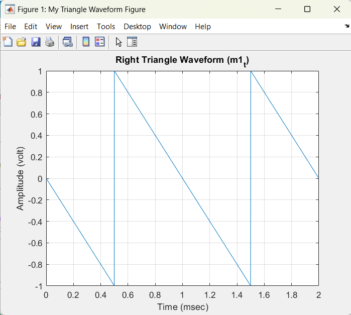 |  | 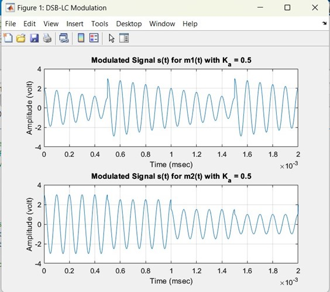 | 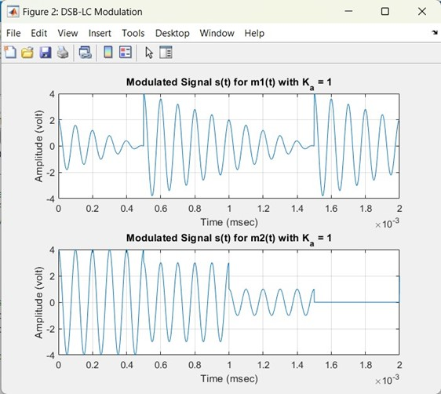 | 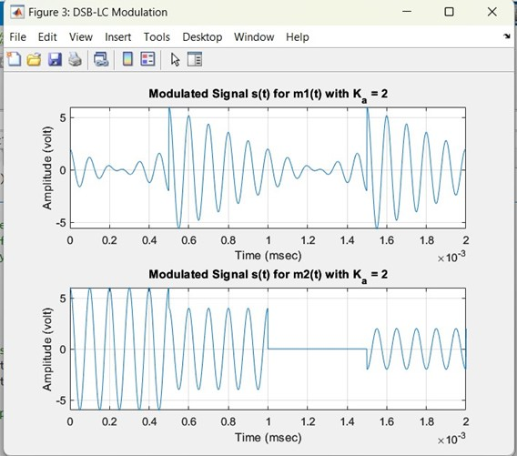 |

---

### 2️⃣ DSB-SC Using MATLAB

**Double Sideband Suppressed Carrier (DSB-SC)** modulation multiplies the message signal by the carrier, transmitting only the upper and lower sidebands while suppressing the carrier. This improves power efficiency but requires a coherent carrier at the receiver for proper demodulation.

**🖼️ Figures (DSB-SC)**  

| DSB-SC Modulated Signal S1(t) | DSB-SC Modulated Signal S2(t) | DSB-SC Demodulated Signal S1(t) | DSB-SC Demodulated Signal S2(t) | Filtered Signal S1(t) | Filtered Signal S2(t) |
| --------------- | --------------- | --------------- | --------------- | --------------- | --------------- |
| 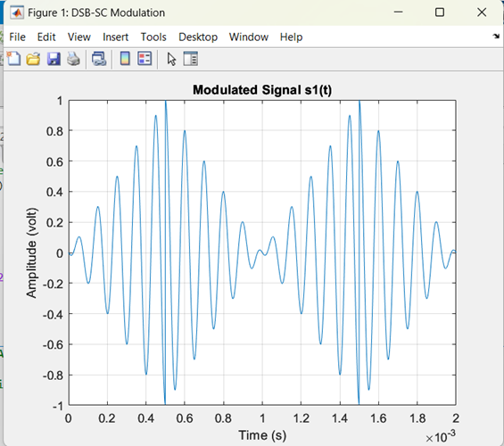 | 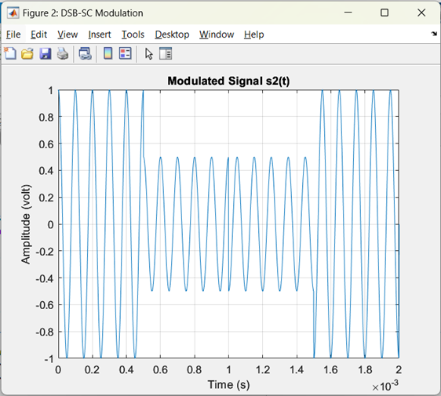 | 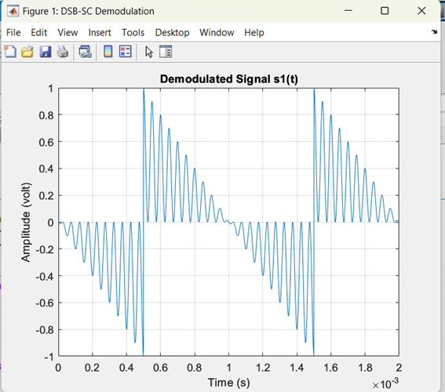 | 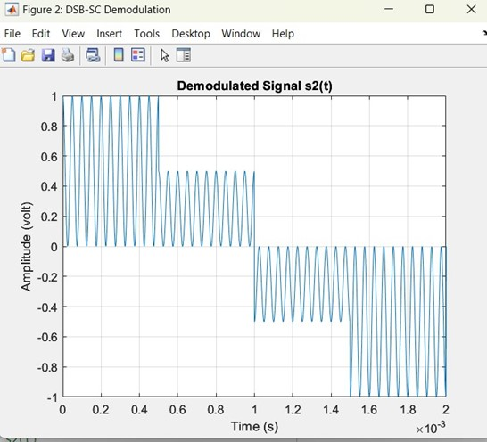 | 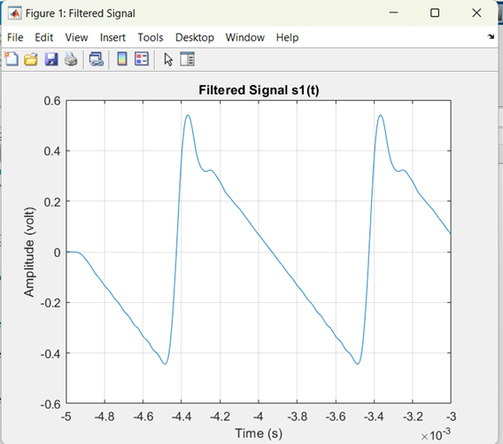 | 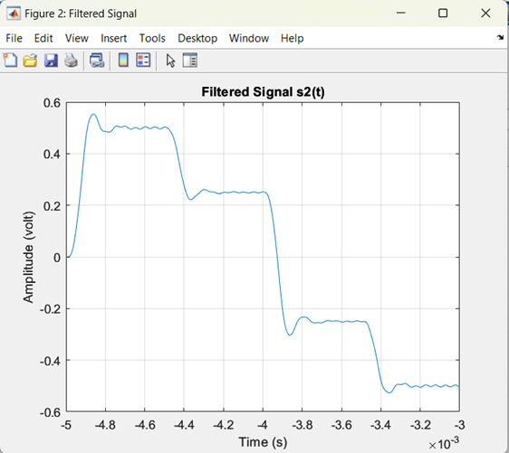 |

---

### 3️⃣ SSB Using MATLAB

**Single Sideband (SSB)** modulation transmits only one of the sidebands (upper or lower), with the carrier either transmitted or suppressed. This method is significantly more bandwidth-efficient than double sideband schemes and is commonly used in long-distance communications such as radio and telephony.

**🖼️ Figures (SSB)**  

| Message Signal m2(t) | USB and LSB | USB and LSB Spectrum | Demodulated Message USB & LSB [Before Filter] | Demodulated Message USB & LSB | Demodulated Message F1 & F2 Offset |
| ------------ | ------------ | ------------ | ------------ | ------------ | ------------ |
| 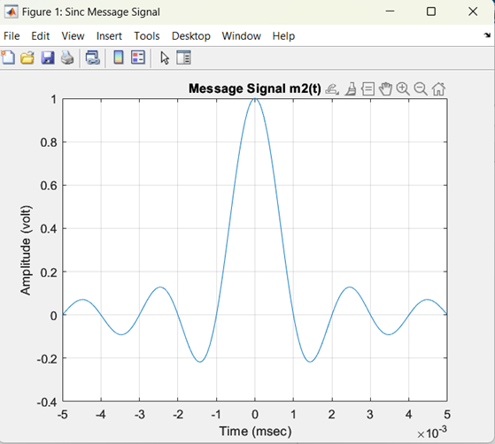 | 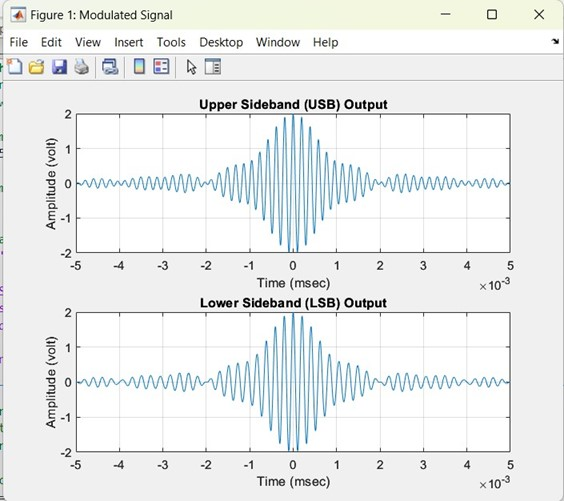 | 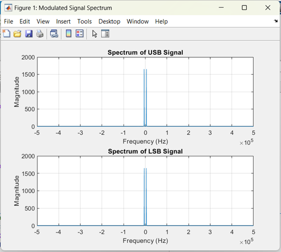 | 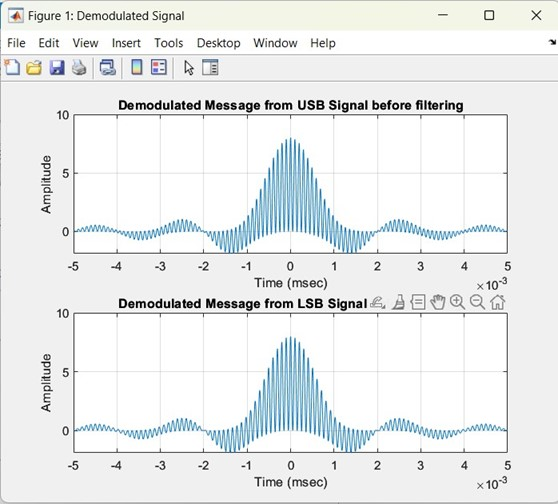 | 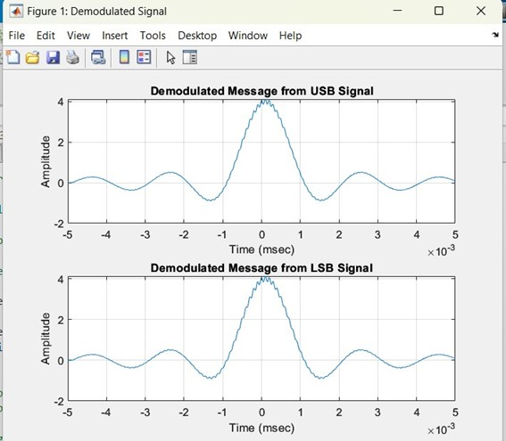 | 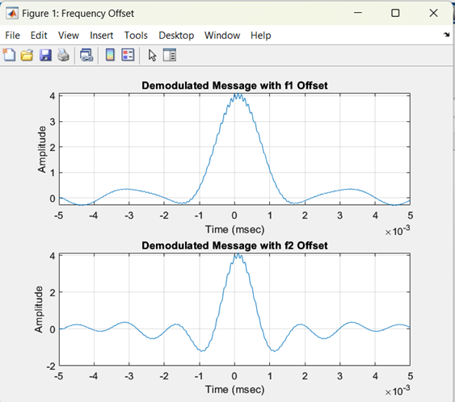 |

## 📄 License

⚠️ **Important Notice:** This repository is publicly available for viewing only. Forking, cloning, or redistributing this project is **NOT** permitted without explicit permission.

Copyright (c) 2024 Chameleon Tech
