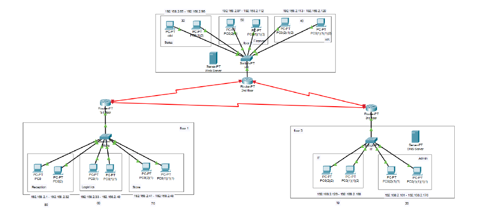

# 🏨 Multi-Floor Enterprise Network – Cisco Packet Tracer

This repository contains a **Cisco Packet Tracer** simulation of a three-floor enterprise/hotel network with multiple departments, VLANs, and core network services.

---

## 📚 Table of Contents

- [Overview](#overview)
- [Features](#features)
- [Network Topology](#network-topology)
- [Tools](#tools)

---

## 🔎 Overview

The project models a **LAN for a three-floor building**, where each department (Reception, Logistics, Store, Sales, Finance, HR, IT, Admin) is placed in its own **subnet / VLAN**.  
Routers connect the floors together and run **OSPF** so that all subnets can communicate and access shared services such as the **DNS** and **Web Server**.

---

## ✨ Features

- 🧩 **Subnetting & VLANs** per department with a structured IP plan  
- 📡 **DHCP** for automatic IP configuration for all hosts  
- 🌐 **OSPF routing** between floor routers for full connectivity  
- 🖥️ **DNS & Web Server** so users can access the hotel services webpage from any department  
- 🧪 End-to-end **connectivity tests** (pings + HTTP access) between floors and departments  

---

## 🗺️ Network Topology

**Final Packet Tracer topology used in the simulation:**

---

## 🛠️ Tools

- Cisco Packet Tracer

## ⚖️ License

⚠️ **Important Notice:** This repository is publicly available for viewing only.  
Forking, cloning, or redistributing this project is **NOT** permitted without explicit permission.

**Copyright (c) 2024 Contributers**
- Muhammad Essam Khattab
- Youssef Alaa Abou-Almagd  
- Ahmed Samy
